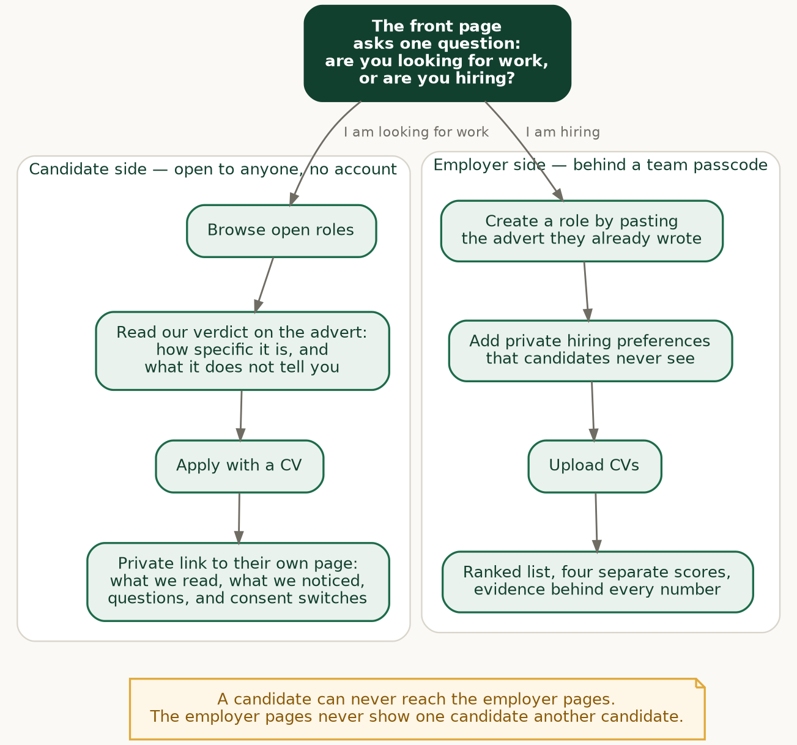
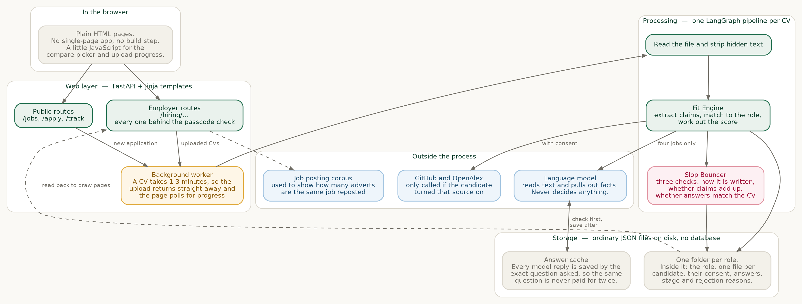
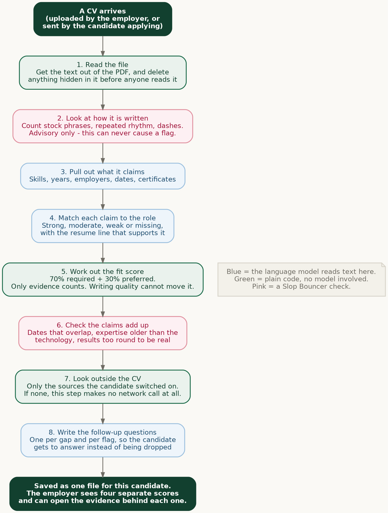
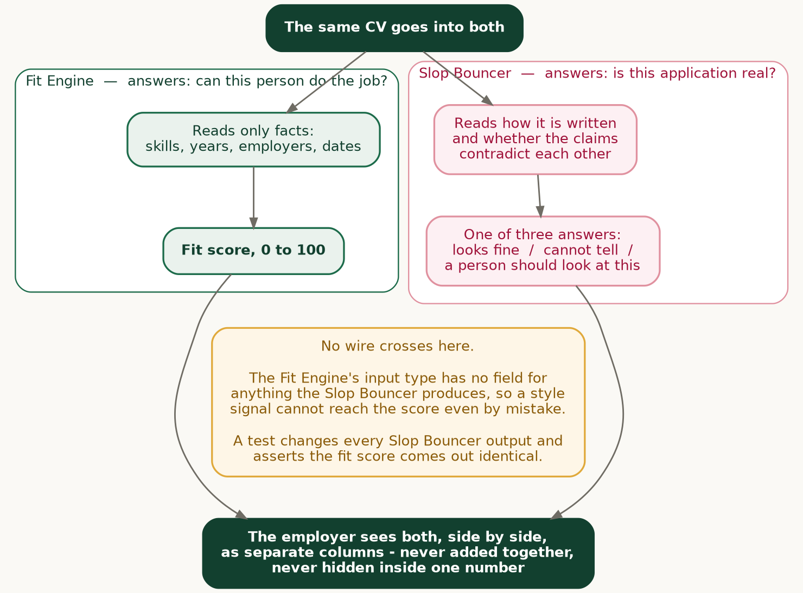
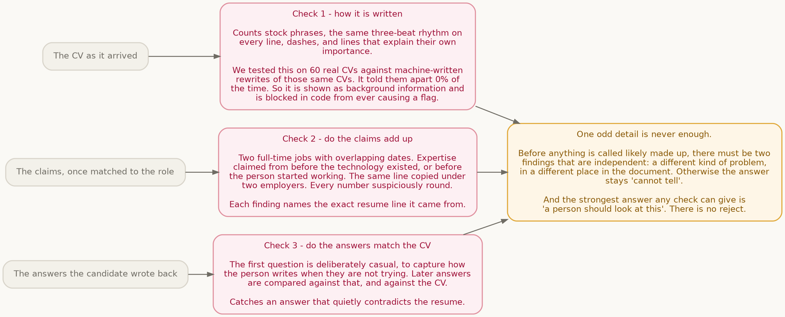
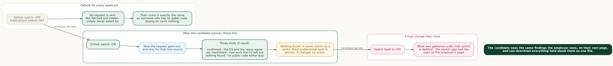
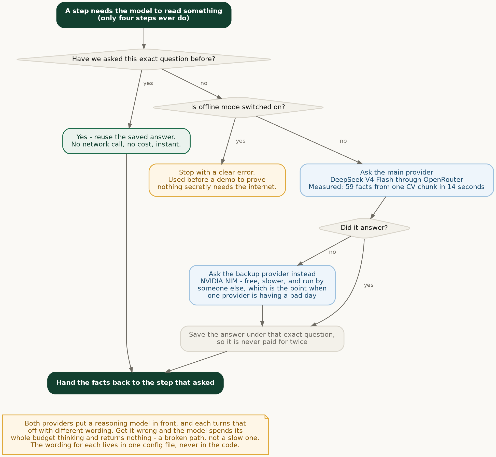

# Fit Happens — how it is built

Written for the demo: read top to bottom, and each diagram is followed by a short explanation
in plain words. Every diagram is a PNG in `doc/diagrams/`, regenerated with
`uv run python -c "import tools.diagrams as d; [f() for f in (d.d1_two_doors, d.d2_layers, d.d3_pipeline, d.d4_separation, d.d5_checkpoints, d.d6_consent, d.d7_llm_call)]"`.

---

## 1. What it is, in three lines

Two problems, deliberately solved by two separate things.

- **Fit Engine** ranks people on the evidence in their CV, not on how well it is written.
- **Slop Bouncer** flags applications that look machine-written or whose claims do not add up.
  It never rejects anyone. The strongest thing it can say is *"a person should look at this."*

They are kept apart on purpose, and the separation is enforced by types and tests rather than
by good intentions. That is section 6.

---

## 2. Tech stack

| Layer | What we used | Why |
|---|---|---|
| Language | Python 3.12, `uv` for environments | Fast installs, one lockfile |
| Web server | FastAPI + Uvicorn | Async, tiny, no boilerplate |
| Pages | Jinja2 templates + Tailwind via CDN | Server-rendered HTML. No build step, no framework |
| Orchestration | LangGraph | The CV pipeline is a graph of eight steps with typed state |
| Model access | `ChatOpenAI` from `langchain_openai`, structured output | One client, schema-validated replies |
| Main model | DeepSeek V4 Flash via OpenRouter | 59 facts from one CV chunk in 14.4s (measured) |
| Backup model | NVIDIA NIM (Nemotron) | Free, independent provider, automatic on any error |
| PDF reading | pypdf, pdfplumber, pdfminer, PyMuPDF, pypdfium2 | Several engines on purpose — see section 8 |
| Storage | JSON files on disk | No database. One folder per role |
| Tests | pytest — **378 passing** | Including the rules in section 9 |

**No database, no queue, no container.** It runs with one command and the whole demo works
from cache with the network unplugged.

---

## 3. What each side can actually do

### Candidate — no account, nothing to sign up for

| | |
|---|---|
| Browse open roles | A plain list of what is hiring |
| See our read of the advert | *"How specific this advert is: 80%. It does not tell you: salary or band."* We hold the employer to the same standard we hold candidates |
| Apply | Name, email, CV. That is the whole form |
| Get a private link | Their own page. No password. Losing it is recoverable by email address |
| See what we read | Every claim we pulled out of their CV |
| See what we noticed | The same flags the hiring team sees — not a sanitised version |
| Answer follow-up questions | A gap becomes a question, not a silent rejection |
| Control what is looked at | Switches for GitHub and publications. Off by default |
| Download everything held about them | One file, their side of the wall |

### Employer — behind a shared team passcode

| | |
|---|---|
| Create a role | Paste the advert you already wrote. We turn it into requirements |
| Review what we extracted | Untick anything we got wrong before the role is created |
| Add private preferences | The real, unpublished ones — with a guard that refuses anything discriminatory |
| Upload CVs | Several at once, processed in the background |
| Ranked list | Four separate scores per person, never blended |
| Sort and filter | By fit, name, sloppiness, bluff risk; or "needs a human", "they replied" |
| Compare two people | Requirements where they differ shown first |
| Open the evidence | Every score traces to a line in the CV |
| Ask follow-up questions | Generated per gap, with a ready-to-send message |
| Move people through stages | Always by hand. Nothing moves on its own |
| Record why someone was passed over | Feeds a feedback view that shows when *we* were wrong |
| Job ad quality | Our clarity score on their own advert |
| Document integrity | What was hidden inside the PDFs |
| Market view | How many adverts are the same job reposted |
| Export the audit trail | Every score, span, consent change and decision |

---

## 4. The two doors



The front page asks one question and sends you down one of two paths. This matters because
the site used to open on the recruiter dashboard — which meant an applicant landed on a page
full of *other applicants'* names and fit scores.

Now the candidate side is public and has no account. The employer side sits behind a shared
passcode. A candidate can never reach the hiring pages, and the hiring pages never show one
candidate anything about another.

---

## 5. The system, layer by layer



Top to bottom: the browser gets ordinary HTML — there is no single-page app and no build step.
FastAPI serves two sets of routes, and every `/hiring` route passes through one passcode check
written in a single place, so a new page cannot accidentally be added unprotected.

A CV takes one to three minutes to process, which is far too long to make someone wait on a
loading page. So the upload returns immediately and the work happens in a background task
while the page quietly polls for progress.

Underneath, everything is JSON files in one folder per role. No database. That sounds like a
shortcut, and for a 24-hour build it partly is — but it also means the entire state of a demo
is a directory you can read, copy, or delete.

---

## 6. What happens to a CV



Eight steps, in order, as a LangGraph pipeline with typed state passed between them.

The colours carry the important message. **Only three steps use the language model at all**
(blue): pull the claims out, match them to the role, and draft the follow-up questions. The
model *reads and extracts*. It never scores, never flags, and never decides. Every number and
every flag comes from plain Python you can step through in a debugger.

Two details worth pointing at during the demo:

- **Step 1 deletes hidden text before anything else runs.** The primary input is a document
  supplied by someone with a direct financial interest in the outcome, so it is treated as
  adversarial from the first line.
- **Step 7 makes no network call at all** unless the candidate has switched a source on.

---

## 7. Two engines, kept apart



This is the part of the design we would defend hardest.

The same CV goes into both engines and they never talk to each other. The Fit Engine's input
type has **no field** for anything the Slop Bouncer produces — so a writing-style signal cannot
reach the fit score even by accident, because there is nowhere to put it.

A test proves it: it mutates every Slop Bouncer output and asserts the fit score comes out
byte-identical.

Why it matters: a well-written CV from the wrong person should lose to a plainly-written CV
from the right person. If style leaked into the score, the tool would be doing exactly what
it exists to stop.

---

## 8. The three checks, and the rule that governs them



Slop Bouncer runs three times, on three different things.

**We measured check 1 and it does not work.** On 60 real CVs against machine-written rewrites
of those same CVs, it told them apart 0% of the time. We report that number rather than tune
it away, and check 1 is blocked in code from ever causing a flag. It is shown as background
information only.

That is not a weakness we are hiding — it is the reason for the corroboration rule. One odd
detail is never enough. Before anything is called likely made up there must be **two
independent findings**: a different kind of problem, in a different place in the document.
Anything less stays *"cannot tell."*

And the strongest answer any check can give is *"a person should look at this."* There is no
reject option in the code — the list of possible answers does not contain one.

---

## 9. Consent decides whether we look, not whether we show



Most tools fetch everything and then hide some of it. We do the opposite: if the switch is
off, **the request is never sent**.

Three results are possible when a source is on: *confirmed* (the CV and the public record
agree), *not mentioned* (real work the CV left out — this one is for the candidate's benefit,
not the employer's), and *nothing found*.

**"Nothing found" is never shown as a strike.** Most professional work is not public. A
candidate with no public code scores exactly the same as one who never turned the switch on.
Turning a switch back off deletes what was gathered under it, on both sides.

---

## 10. What one model call actually does



Every model call checks the cache first, keyed by the exact question asked. A repeat question
costs nothing and returns instantly — which is why the whole demo runs with the network
unplugged once it has been run through once.

If the main provider fails for any reason, a completely different provider is tried
automatically. During a live demo that independence is the entire point.

One hard-won detail: both providers put a *reasoning* model in front, and each one turns
reasoning off with different wording. Get it wrong and the model spends its whole token budget
on an internal monologue and returns an empty answer — a broken path, not a slow one. The
wording for each provider lives in one config file and never in the code.

---

## 11. The rules that are enforced by tests, not by hope

Each of these is a sentence you can say out loud, backed by a test that would fail if it
stopped being true.

| Rule | What proves it |
|---|---|
| Writing quality cannot move the fit score | `test_fit_score_is_unchanged_by_any_slop_signal` |
| It cannot reject anyone | `test_no_reject_path`, `test_flagging_is_never_a_rejection` |
| Style alone is never evidence | `test_maximum_style_score_alone_cannot_flag` |
| Style never even reaches the corroboration step | `test_style_flags_are_excluded_from_corroboration` |
| Fabrication needs two *independent* findings | `test_two_flags_of_the_same_pattern_are_not_independent`, `test_two_patterns_on_the_same_span_are_not_independent`, `test_two_distinct_patterns_on_distinct_spans_corroborate` |
| No public GitHub is never a penalty | `test_missing_github_never_lowers_any_score` |
| Silence about a requirement is not the same as failing it | `test_silence_never_scores_worse_than_contradiction` |
| How much evidence there is cannot itself become a score | `test_evidence_density_is_not_an_input_to_the_score` |
| Every finding carries the line it came from | `test_every_pattern_carries_a_span` |
| Hidden text never reaches the model | `test_injection_never_reaches_prompt` |
| A private preference cannot become a discrimination filter | `test_protected_characteristics_are_blocked`, `test_blocked_constraint_never_reaches_the_scorer` |
| Stages are only ever set by a person | `test_the_system_never_sets_a_stage_from_a_score` |
| Granting consent actually triggers the fetch | `test_granting_a_scope_triggers_the_fetch_it_authorises` |
| Every consent switch changes real behaviour | `test_every_consent_scope_actually_changes_behaviour` |
| The review queue never selects on style | `test_the_review_queue_never_selects_on_style_alone` |

---

## 12. Where things live

```
src/fit_happens/
  web/          FastAPI routes, passcode check, background tasks, templates
  pipeline.py   the eight-step graph
  ingest/       PDF reading, hidden-text detection, sanitising
  fit/          claim extraction, matching, scoring, gaps, questions
  slop/         the three checks and the corroboration rule
  verify/       GitHub, publications, certificates, document age
  jd/           advert parsing, the discrimination guard, market view
  candidate/    consent, applications, answers
  store.py      the JSON-on-disk layer
config/models.yaml   which model does which job, and how to turn reasoning off
doc/            this file, the brief, the demo script, the engineering log, the backlog
```

**Two engines, one rule each.** `fit/` answers *can they do the job.* `slop/` answers
*is this real.* Nothing in `fit/` imports anything from `slop/`.
